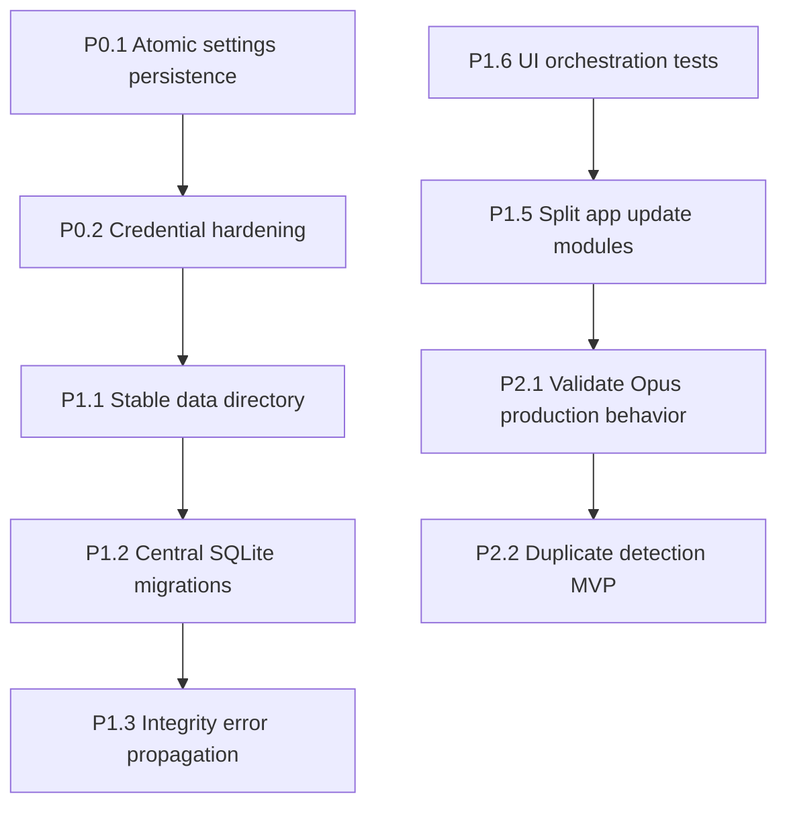

# CrabBoss — Agent Engineering Backlog

Dokumen ini adalah backlog implementasi yang dapat langsung diberikan kepada coding
agent. Prioritas disusun berdasarkan risiko siaran/data terlebih dahulu, lalu
maintainability dan fitur produk.

> **Baseline yang diverifikasi (2026-09-14, diperbarui)**
>
> - Branch: `main`, commit `6a9b26d` (`Add Opus-in-Ogg stream output alongside MP3`).
> - Workspace Rust: `crabcore` (engine/domain/storage) dan `crabui` (Iced desktop UI).
> - Perubahan terbaru sejak baseline awal:
>   - UI dipecah ke `app`, `screens`, dan `widgets`;
>   - backup/restore JSON untuk settings, scheduler, carts, dan ads;
>   - library filters dan recent plays;
>   - streaming output Opus-in-Ogg selain MP3;
>   - widget unit tests.
> - Kualitas saat revalidasi: `cargo test --workspace` lulus (131 test core dan
>   16 test UI), `cargo fmt --all -- --check` lulus, dan
>   `cargo clippy --workspace --all-targets -- -D warnings` lulus.
> - Jangan mengubah atau menghapus `settings.json`, `crabboss.db`, atau data
>   pengguna saat mengerjakan task kecuali task secara eksplisit memerlukan
>   migrasi yang aman.

---

## Aturan kerja untuk coding agent

1. **Kerjakan satu task atau satu kelompok task yang benar-benar terkait per PR.**
   Hindari mencampur refactor besar, perubahan behavior audio, dan fitur baru.
2. **Jaga kompatibilitas data.** Database SQLite dan `settings.json` adalah data
   operasional stasiun. Setiap perubahan format harus memiliki migrasi dan test
   upgrade.
3. **Realtime audio tidak boleh diblok.** Jangan menambah I/O, decode, database,
   alokasi besar, atau lock baru di callback CPAL.
4. **Jangan menyembunyikan error penting.** Error database, persistence, dan
   stream harus tercatat dengan `tracing` dan, bila relevan, terlihat oleh
   operator di UI.
5. **Jangan log secrets.** Password stream, credential, maupun token tidak boleh
   tampil di log, `Debug`, error text, screenshot UI, atau file config umum.
6. **Validasi setiap task:**

   ```sh
   cargo fmt --all -- --check
   cargo clippy --workspace --all-targets -- -D warnings
   cargo test --workspace
   ```

7. **Tambahkan test regresi** untuk setiap bug/risk behavior yang diperbaiki.
   Test harus tidak membutuhkan audio device, server Icecast publik, atau GUI
   window kecuali benar-benar diperlukan.
8. **Lisensi adalah out of scope sampai ada keputusan produk.** Jangan mengubah
   format key, checksum/signature, tier, expiry, `features_enabled()`, activation,
   enforcement, atau lokasi `license.json` dalam task backlog ini. Perubahan
   lisensi hanya boleh dilakukan melalui task/desain terpisah yang disetujui.

---

# Prioritas P0 — Integritas data dan secret

## P0.1 — Persistence settings atomic dan error-aware

### Masalah saat ini

`crates/core/src/settings.rs` menyimpan settings langsung ke file target:

```rust
std::fs::write(path, serde_json::to_string_pretty(self).unwrap_or_default())
```

Settings juga dibaca dengan pola yang mengubah semua error menjadi default:

```rust
std::fs::read_to_string(path)
    .ok()
    .and_then(|t| serde_json::from_str(&t).ok())
    .unwrap_or_default()
```

Konsekuensinya:

- crash atau power loss saat write dapat meninggalkan JSON terpotong;
- JSON corrupt, permission error, atau disk I/O error terlihat sama seperti
  first run;
- aplikasi dapat mengganti konfigurasi stasiun menjadi default secara diam-diam.

### Scope implementasi

1. Definisikan hasil load eksplisit, misalnya:

   ```rust
   pub enum SettingsLoad {
       Missing(AppSettings),
       Loaded(AppSettings),
       Invalid { defaults: AppSettings, error: String },
       IoError { defaults: AppSettings, error: std::io::Error },
   }
   ```

   Desain tipe boleh berbeda, tetapi caller wajib dapat membedakan `Missing`,
   JSON invalid, dan I/O error.

2. Pertahankan sanitasi konfigurasi setelah file valid berhasil di-deserialize.

3. Implementasikan atomic write di folder yang sama dengan target:

   - serialize terlebih dahulu dan propagate serialization error;
   - buat temporary file dengan nama unik di parent target;
   - write seluruh bytes;
   - `sync_all()` temporary file;
   - rename/replace ke path final;
   - bila gagal, jangan sentuh file target sebelumnya dan bersihkan temporary
     file best-effort.

4. Perhatikan behavior Windows: rename tidak selalu menggantikan file existing.
   Gunakan strategi replace yang aman dan teruji untuk platform target. Jangan
   menghapus file lama sebelum pengganti sudah sepenuhnya ditulis dan siap.

5. Ubah `crates/ui/src/app.rs` agar:

   - first run tidak menghasilkan warning;
   - file invalid/I/O error menghasilkan status/operator warning yang actionable;
   - save failure tidak hanya masuk log, tetapi dapat ditampilkan pada Settings;
   - settings in-memory yang sedang aktif tidak di-reset ketika persistence gagal.

6. **Out of scope:** jangan mengubah persistence atau behavior lisensi pada task
   ini. `LicenseStore` tetap seperti sekarang sampai ada keputusan produk khusus.

### Acceptance criteria

- Existing file tetap valid/utuh ketika penulisan baru gagal.
- File JSON invalid tidak ditimpa otomatis.
- First-run file yang belum ada tetap memakai default tanpa error.
- UI/log membedakan missing settings dari corrupt atau unreadable settings.
- Tidak ada `unwrap_or_default()` yang menyembunyikan kegagalan serialisasi
  dalam jalur save settings.

### Test minimum

- save/load round-trip normal;
- missing file menghasilkan default/first-run outcome;
- malformed JSON menghasilkan outcome invalid, bukan `Loaded` atau silent default;
- write failure mempertahankan isi file lama (gunakan path/directory invalid atau
  abstraction filesystem yang testable);
- temporary artifact dibersihkan ketika write gagal;
- tidak ada perubahan pada file, format, atau behavior lisensi.

### Prompt siap pakai

> Implementasikan atomic, error-aware persistence untuk `AppSettings` di
> `crates/core/src/settings.rs` dan sesuaikan pemakaiannya di
> `crates/ui/src/app.rs`. Bedakan first-run file missing dari corrupt JSON dan
> I/O failure. Tulis melalui temporary sibling file, sync, lalu replace atomically
> tanpa merusak file lama jika save gagal. Surface error persistence ke operator.
> Jangan ubah `LicenseStore` atau behavior lisensi. Tambahkan regression tests,
> lalu jalankan fmt, clippy warnings denied, dan test workspace.

---

## P0.2 — Amankan credential Icecast

### Masalah saat ini

`StreamConfig` memiliki `password: String` dan ikut diserialisasi sebagai bagian
`AppSettings`. Field password pada `crates/ui/src/screens/settings.rs` juga
menggunakan `text_input` biasa, sehingga terlihat jelas di UI.

`.gitignore` memang mengecualikan `settings.json`, tetapi ini tidak melindungi
secret dari akses lokal, backup/sync tooling, malware, atau shoulder surfing.

### Tahap A: hardening tanpa dependency baru

1. Gunakan masked/password input pada Settings UI.
2. Tambahkan aksi eksplisit:
   - Set/replace password;
   - Clear password;
   - status apakah password telah disimpan, tanpa menampilkan nilainya.
3. Jangan mengabaikan input kosong sebagai cara implisit mempertahankan secret.
   User harus dapat benar-benar menghapus password dengan aksi jelas.
4. Pastikan `Debug`, `Display`, tracing, UI error, dan test failure tidak
   menyertakan plaintext password.
5. Dokumentasikan risiko plaintext lokal sampai credential-store diterapkan.

### Tahap B: DROPPED by owner decision (2026-09-14)

Plaintext di `settings.json` diterima apa adanya. Jangan kerjakan credential
store / migration / reference-secret dalam task backlog ini.

### Acceptance criteria

- Password ditampilkan plaintext di Settings UI by owner decision (2026-09-14).
- Tidak ada secret di tracing, error, atau `Debug` output (Stage A tetap berlaku).
- Operator bisa clear dan mengganti credential secara eksplisit.
- Backup JSON turut membawa password plaintext — perlakukan file backup sama
  sensitifnya dengan `settings.json`.

### Test minimum

- `Debug` redaction (`debug_redacts_password_but_keeps_other_fields`);
- clear-password benar-benar membuat start stream gagal dengan error yang jelas.

### Prompt siap pakai

> Hardening Icecast credentials (Stage A only, Stage B dropped). Pertahankan
> password input yang masked, clear flow eksplisit, dan jaminan tidak ada secret
> di log/debug/UI errors. Jangan menambah secret store.

---

## P0.3 — Backup/restore atomic dan all-or-nothing

### Konteks baru

`crates/ui/src/backup.rs` sudah menyediakan backup JSON versioned dan restore
untuk settings, scheduler, carts, serta ads. Ini merupakan improvement besar
untuk operability, tetapi menambah jalur persistence dan mutasi multi-store:

- `write_backup` masih memakai write langsung ke file target;
- `apply_backup` menyimpan settings dan menghapus/membuat ulang scheduler,
  carts, serta ads secara bertahap;
- bila satu langkah restore gagal setelah list lama sudah dihapus, state bisa
  menjadi restore parsial;
- backup saat ini membawa `AppSettings`, sehingga turut membawa stream password
  plaintext selama P0.2 belum selesai.

### Scope implementasi

1. Gunakan primitive atomic write dari P0.1 untuk `write_backup`.
2. Pisahkan validasi dan apply:
   - parse/version validation;
   - validasi semua DTO sebelum state live dihapus;
   - buat restore plan dan summary invalid rows.
3. Jadikan restore database lists transactional. Scheduler, carts, dan ads
   berbagi database SQLite yang sama, sehingga idealnya replace seluruh list
   dijalankan dalam satu transaction connection/migration boundary.
4. Tentukan policy invalid row secara eksplisit:
   - **strict**: tolak seluruh restore jika satu row invalid; atau
   - **best effort**: apply valid row, tetapi jangan menghapus list existing
     sebelum plan valid dan user telah melihat warning.
   Pilih satu policy, dokumentasikan di UI, dan test secara menyeluruh.
5. Jangan sertakan stream password dalam backup setelah P0.2 tahap B. Untuk
   backup legacy, restore harus meminta/menandai credential sebagai perlu
   dimasukkan ulang.
6. Backup/restore harus menghentikan atau mengelola stream/mic secara aman agar
   config lama tidak terus berjalan setelah restore config baru diterapkan.

### Acceptance criteria

- Gagal write backup tidak merusak backup file sebelumnya.
- Restore gagal tidak menghasilkan scheduler/cart/ad set yang setengah lama dan
  setengah baru.
- File backup invalid/version tidak didukung tidak memodifikasi aplikasi.
- Policy credential backup eksplisit dan tidak mengekspos secret.
- Ada status UI yang menjelaskan apa yang di-restore, di-skip, atau gagal.

### Test minimum

- atomic backup write;
- invalid JSON dan unsupported version tidak memutasi state;
- invalid item mengikuti strict/best-effort policy yang dipilih;
- induced manager failure rollback/retains old lists;
- settings/stream credential tidak bocor ke backup pada desain secret-store.

### Prompt siap pakai

> Harden `crates/ui/src/backup.rs`: gunakan atomic write, validasi backup penuh
> sebelum mutasi, dan jadikan restore scheduler/carts/ads all-or-nothing dengan
> transaction atau policy best-effort yang eksplisit dan aman. Pastikan failure
> tidak menghapus state lama secara parsial. Integrasikan dengan policy credential
> P0.2 agar secret tidak dibackup plaintext. Tambahkan tests tanpa GUI/audio device.

---

# Prioritas P1 — Deployment, database, dan testability

## P1.1 — Stable runtime-data directory

### Masalah saat ini

`crates/ui/src/app.rs::boot` menyelesaikan path `settings.json`, `crabboss.db`,
dan `license.json` dari `std::env::current_dir()`.

Executable yang sama dapat memiliki state berbeda bila dijalankan dari shortcut,
Explorer, terminal, atau current directory lain.

### Scope implementasi

1. Tambahkan modul core, misalnya `crates/core/src/paths.rs`.
2. Definisikan `AppPaths`:

   ```rust
   pub struct AppPaths {
       pub root: PathBuf,
       pub settings: PathBuf,
       pub database: PathBuf,
       pub license: PathBuf,
   }
   ```

3. Gunakan lokasi per-user yang stabil:
   - Windows: `%LOCALAPPDATA%\\CrabBoss`;
   - desain API agar platform lain dapat ditambah kemudian.
4. Buat root directory sebelum store dibuka.
3. Tambahkan override eksplisit `--data-dir <path>` untuk portable install/test.
6. Tambahkan migrasi satu kali dari legacy current-directory files untuk
   **settings dan database saja**:
   - bila destination kosong dan legacy file ada, copy/import dengan aman;
   - jangan overwrite destination yang telah ada;
   - tampilkan/log hasil migrasi;
   - database harus dipindahkan bersama sidecar SQLite yang relevan bila ada;
   - **jangan memindahkan `license.json` pada task ini**; lisensi out of scope.

### Acceptance criteria

- Satu instalasi memakai root data yang konsisten, terlepas dari CWD.
- Tidak ada `current_dir()` tersebar untuk persistent state.
- Existing user dapat meng-upgrade tanpa kehilangan data.
- Data location dapat ditemukan/dilaporkan di Settings atau startup logs.

### Test minimum

- derivasi path dengan explicit `--data-dir`;
- migration legacy ketika destination kosong;
- destination existing selalu menang;
- path resolver tidak membuat directory pada fungsi pure resolver bila desain
  memisahkan resolve/create.

### Prompt siap pakai

> Buat resolver path terpusat di core untuk database dan settings, lalu ubah
> `crates/ui/src/app.rs::boot` agar resolve path sekali saja. Gunakan data dir
> per-user yang stabil di Windows dan dukung `--data-dir` untuk portable use.
> Tambahkan migrasi aman dari legacy database/settings di current directory serta
> regression tests. Jangan mengubah schema database, `LicenseStore`, atau lokasi
> `license.json` pada task ini.

---

## P1.2 — Bootstrap dan migrasi SQLite terpusat

### Masalah saat ini

Library, playlist, scheduler, cart, dan ads membuka connection sendiri terhadap
file SQLite yang sama. Library mengembalikan `Result`, tetapi beberapa manager
menggunakan `expect()` untuk foreign-key/schema setup.

Migrasi tersebar di beberapa manager melalui schema inspection + `ALTER TABLE`
tanpa versioning global atau transaction migration boundary.

### Scope implementasi

1. Tambahkan satu database bootstrap API di core, misalnya:

   ```rust
   pub struct Database;
   impl Database {
       pub fn initialize(path: &Path) -> Result<()>;
       pub fn open_connection(path: &Path) -> Result<Connection>;
   }
   ```

2. Gunakan `PRAGMA user_version` sebagai nomor schema global.
3. Setiap migrasi harus:
   - bernomor;
   - idempotent/reopen-safe;
   - dibungkus transaction;
   - meningkatkan user version hanya setelah sukses.
4. Konfigurasi setiap connection secara konsisten:
   - `PRAGMA foreign_keys = ON`;
   - busy timeout yang bounded;
   - journal/synchronous policy yang didokumentasikan.
5. Ubah constructor manager dan `init_tables` agar mengembalikan `Result`,
   bukan panic pada kegagalan schema.
6. Jangan membuat connection pool kecuali requirement concurrency berubah.

### Acceptance criteria

- Tidak ada production `expect()` untuk schema/PRAGMA initialization.
- Kegagalan migration menghasilkan `CrabError` yang kontekstual, bukan crash.
- Database dari versi lama dimigrasi sekali dan dapat dibuka ulang tanpa
  perubahan schema tambahan.
- Foreign key cascade existing tetap lulus.

### Test minimum

- fixture/database legacy untuk setiap versi schema yang masih didukung;
- migration idempotency (open dua kali);
- forced migration failure menghasilkan error dan tidak menandai version sukses;
- multi-connection lock contention memiliki behavior bounded dan error jelas.

### Prompt siap pakai

> Sentralisasikan database bootstrap/migration CrabBoss menggunakan
> `PRAGMA user_version`, migration transactional dan idempotent. Konfigurasikan
> semua connection secara konsisten, ubah init manager playlist/scheduler/cart/ads
> dari panic menjadi `Result`, dan tambahkan fixture migration tests. Pertahankan
> schema/data existing serta FK cascade behavior.

---

## P1.3 — Propagasi error database dan integrity data

### Masalah saat ini

Beberapa query dan row mapper mengubah data/error menjadi nilai fallback:

- `loudness_gain_by_path` membedakan row tidak ada dan SQL error secara lemah;
- timestamp malformed dapat diganti dengan waktu sekarang;
- tanggal ad malformed dapat diganti date range default.

Fallback seperti ini membuat data corrupt terlihat normal dan bisa mengubah
perilaku scheduler/report tanpa jejak jelas.

### Scope implementasi

1. Gunakan `rusqlite::OptionalExtension` untuk query opsional, sehingga hanya
   `QueryReturnedNoRows` menjadi `Ok(None)`.
2. Tambahkan error tipe data-integrity di `crates/core/src/error.rs` bila
   diperlukan: table, field, record id/value yang invalid.
3. Row mapping invalid harus menghasilkan error kontekstual, bukan mengganti
   business data dengan nilai default.
4. UI refresh dapat menampilkan warning/error operator, bukan list kosong
   yang seolah valid.

### Test minimum

- no row => `Ok(None)`;
- SQL failure => error, bukan `None`;
- malformed date/timestamp fixture => integrity error;
- UI/domain caller tidak crash terhadap error tersebut.

---

## P1.4 — Cart replacement transactional dan position unik

### Masalah saat ini

Cart replacement berpotensi delete row lama kemudian gagal insert row baru,
sehingga pad menjadi kosong. Schema juga harus menjamin satu cart per position.

### Scope implementasi

1. Pastikan terdapat `UNIQUE(position)` untuk cart pad.
2. Tambahkan migration repair deterministik untuk duplicate position legacy.
3. Jadikan `assign_at` transaction atau upsert keyed by position.
4. Invalid pad position harus mengembalikan error jelas, kecuali UI contract
   secara eksplisit membutuhkan no-op.

### Test minimum

- insert replacement failure mempertahankan cart lama;
- hanya satu cart per position;
- migration duplicate repair;
- invalid position.

---

## P1.5 — Pecah `crates/ui/src/app.rs` berdasarkan domain

### Status saat ini

Commit `cf0636e` sudah berhasil memecah entry point, widgets, dan screen views.
Namun `crates/ui/src/app.rs` masih sekitar 2.246 baris dan memuat state,
messages, boot, central update, serta tick automation.

Refactor ini tidak mendesak untuk correctness, tetapi sebaiknya dilakukan
sebelum fitur besar berikutnya agar perubahan lebih reviewable dan testable.

### Scope implementasi

Pecah bertahap tanpa behavior change:

```text
crates/ui/src/
  app/
    mod.rs          # public facade + Iced dispatcher
    state.rs        # App, Screen, SettingsSection, editor form state
    message.rs      # Message enum
    boot.rs         # startup/dependency wiring
    tick.rs         # periodic processing + Auto-DJ/scheduler/silence
    update/
      mod.rs
      transport.rs
      library.rs
      scheduler.rs
      carts.rs
      ads.rs
      reports.rs
      settings.rs
```

`update` utama harus tetap menjadi dispatcher kecil yang dipanggil Iced.

### Acceptance criteria

- Tidak ada behavior/audio timing change.
- Tidak ada cyclic modules.
- App state tidak dipindahkan ke global mutable state.
- Semua quality gates tetap hijau.

---

## P1.6 — Tambah test UI orchestration tanpa GUI automation

### Masalah saat ini

`crabcore` memiliki test kuat dan `crabui` kini memiliki unit test untuk helper
widget/formatting. Namun, `crabui` belum memiliki test untuk orchestration state.
Risk terbesar tetap berada di logic state dan transition, bukan rendering Iced.

### Scope implementasi

Extract pure/testable helpers secara minimal dari app update/tick untuk menguji:

- Auto-DJ cold start;
- prefetch hanya sekali ketika decode masih in-flight;
- queued deck promotion mempertahankan source label;
- manual play/stop membersihkan pending source dan up-next secara tepat;
- scheduler tidak firing duplikat di waktu/day yang sama;
- validasi input scheduler dan ad editor;
- persistence error status dapat ditampilkan tanpa mematikan operasi aktif.

### Batasan

- Jangan memerlukan window Iced.
- Jangan memerlukan audio device.
- Jangan memerlukan server Icecast publik.
- Hindari mock framework besar bila pure functions/simple fake sudah cukup.

### Acceptance criteria

- `crabui` memiliki unit tests untuk state rules penting.
- Test tidak flaky dan tidak bergantung pada current local clock kecuali time
  di-inject sebagai input.

---

# Prioritas P2 — Audio/stream capability dan fitur produk

## P2.1 — Encoder streaming: Opus selesai, validasi production lalu evaluasi AAC/FLAC

### Status terbaru

**Opus-in-Ogg telah selesai di commit `6a9b26d`.** Implementasinya mencakup:

- `StreamFormat::Opus` di `crates/core/src/stream/mod.rs`;
- abstraction `StreamEncoder` dan encoder selection di
  `crates/core/src/stream/encoder.rs`;
- encoder Opus 48 kHz stereo, Ogg framing, CBR, dan resample device-rate di
  `crates/core/src/stream/encoder_opus.rs`;
- format selector dan bitrate behavior di Settings;
- compatibility lama: config tanpa field `format` tetap menjadi MP3;
- unit test parsing Ogg packet/header, 48 kHz, 44.1 kHz resample, odd chunks,
  config serialization, dan UI helper bitrate.

MP3 tetap tersedia melalui `encoder_mp3.rs`. Task implementasi Opus **tidak lagi
menjadi backlog**.

### Task berikutnya: production validation Opus

Sebelum menambah format ketiga, lakukan smoke/integration validation terhadap
Icecast nyata atau fixture server lokal:

1. Connect source Opus ke Icecast plain dan TLS.
2. Verifikasi mount dapat dibuka oleh player yang mendukung Ogg/Opus.
3. Verifikasi reconnect mengirim Ogg headers baru dan listener baru dapat decode.
4. Verifikasi metadata `StreamTitle`, buffering, dan shutdown/flush behavior.
5. Uji beberapa device rate (44.1 kHz dan 48 kHz minimal) serta bitrate ladder.
6. Dokumentasikan mount/content type yang direkomendasikan dan compatibility
   caveat player.

### Kandidat format berikutnya

1. **AAC-LC** — kompatibilitas luas untuk player/mobile, tetapi pilih encoder
   dengan lisensi, Windows build/distribution, dan container protocol yang jelas.
2. **FLAC** — lossless tetapi bandwidth tinggi; jadikan optional mount,
   bukan default broadcast stream.

Jangan mulai AAC atau FLAC sebelum production validation Opus selesai dan
contract `StreamEncoder` terbukti memadai.

### Acceptance criteria untuk AAC/FLAC proposal

Sebelum coding, agent wajib menulis design note singkat berisi:

- crate/library encoder kandidat dan lisensinya;
- availability/prebuilt story Windows dan cross-platform;
- MIME type + container yang tepat untuk Icecast;
- bitrate/sample-rate/channel constraints;
- CPU/bandwidth/latency trade-off;
- strategi test decoder/integration;
- migration/default behavior bagi `StreamConfig` lama.

### Prompt siap pakai

> Validasi implementasi Opus-in-Ogg yang sudah ada terhadap Icecast lokal atau
> staging: source connect (plain/TLS), playable mount, reconnect/header reset,
> metadata, flush, dan 44.1/48 kHz paths. Jangan mengubah codec behavior kecuali
> menemukan bug yang direproduksi; tambahkan integration test atau documented
> manual test plan. Setelah itu, buat design note untuk AAC-LC sebagai format
> berikutnya—jangan implementasikan AAC dalam task yang sama.

---

## P2.2 — Duplicate track detection MVP

### Scope yang disarankan

Mulai dengan kandidat duplicate non-destruktif:

1. Normalisasi title/artist.
2. Kombinasikan duration tolerance dan file size sebagai kandidat awal.
3. Opsional: hash content untuk konfirmasi (background worker).
4. Tambahkan screen/list hasil grouped candidates.
5. Jangan delete, merge, atau rewrite metadata otomatis pada MVP.
6. Export report CSV bila sudah sesuai pola reporting existing.

### Acceptance criteria

- Deterministic result untuk input sama.
- UI tidak freeze saat scan besar.
- Tidak ada destructive action.
- Ada test normalization/grouping dan scan fixture.

---

## P2.3 — Library health dan background work observability

### Scope

Perbaiki UX untuk proses yang sudah ada: import, loudness scan, health scan.

- tampilkan progress, success, failure, skipped count;
- cancellation policy yang eksplisit;
- summary error yang bisa dibaca operator;
- jangan hanya log missing/corrupt file;
- simpan hasil scan terakhir bila berguna.

Ini akan meningkatkan operability sebelum menambah mass tag editor, BPM scan,
dan folder auto-sync.

---

# Fitur roadmap besar — jangan dikerjakan tanpa desain terpisah

Task di bawah berguna tetapi bukan kandidat pertama untuk autonomous agent karena
memiliki scope/risiko besar:

| Fitur | Alasan perlu desain dulu |
|---|---|
| Voice tracking / auto-intro | Butuh recording pipeline, latency model, timeline editing, dan failure-safe playout |
| Web remote / headless mode | Butuh auth, API contract, remote threat model, state ownership, dan observability |
| AAC streaming | Harus memilih encoder/library/container dengan lisensi dan Windows build story jelas |
| FLAC streaming | Butuh bandwidth policy, client compatibility, dan encoding/mount strategy |
| Shoutcast source support | Memiliki compatibility/protocol behavior sendiri; pisahkan dari encoder work |
| Mass tag editor | Perlu transactional metadata write, backup/rollback policy, dan conflict handling |

---

# Rekomendasi urutan PR



Urutan `P1.5` dan `P1.6` dapat ditukar: bila agent lebih produktif dengan
refactor lebih dahulu, pecah state/message/boot sebelum menambah test; bila
ingin risiko rendah, extract pure functions lalu test dulu.

---

# Checklist review sebelum merge

- [ ] Tidak ada perubahan tanpa test untuk behavior kritis.
- [ ] Tidak ada blocking I/O, DB, encode, atau decode baru dalam audio callback.
- [ ] Tidak ada secret dalam diff, log, error, fixture, screenshot, atau test output.
- [ ] Database/settings lama tetap dapat dibuka atau memiliki migrasi jelas.
- [ ] Migration dapat dijalankan ulang dengan aman.
- [ ] Error baru memiliki context yang cukup untuk operator.
- [ ] UI mengkomunikasikan failure penting, bukan hanya `tracing` log.
- [ ] `cargo fmt --all -- --check` lulus.
- [ ] `cargo clippy --workspace --all-targets -- -D warnings` lulus.
- [ ] `cargo test --workspace` lulus.
- [ ] README/ROADMAP/settings example diperbarui bila user-facing behavior berubah.
